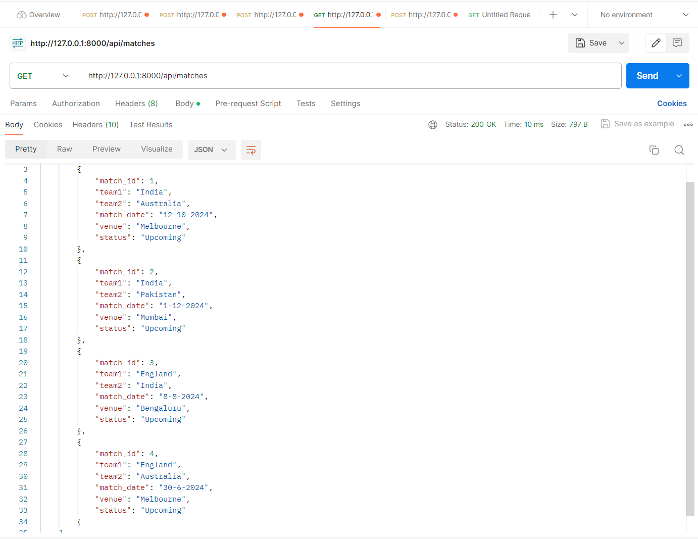
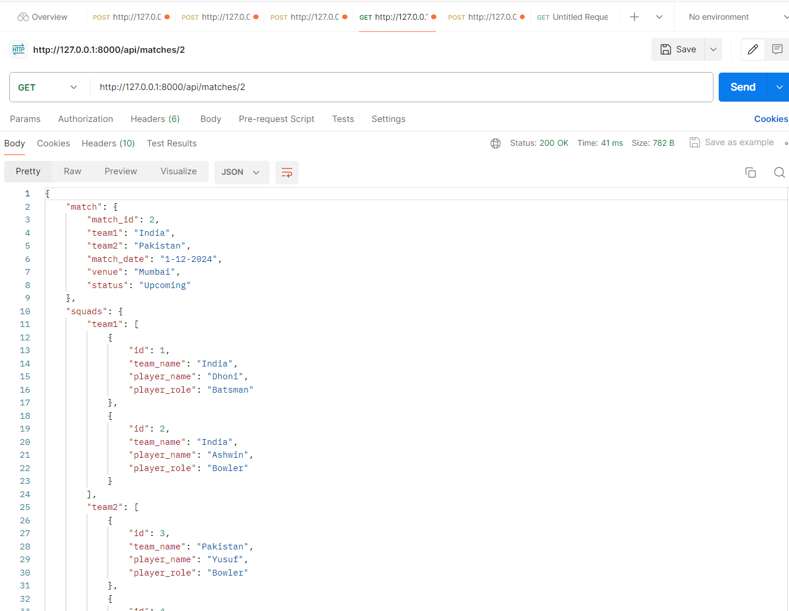
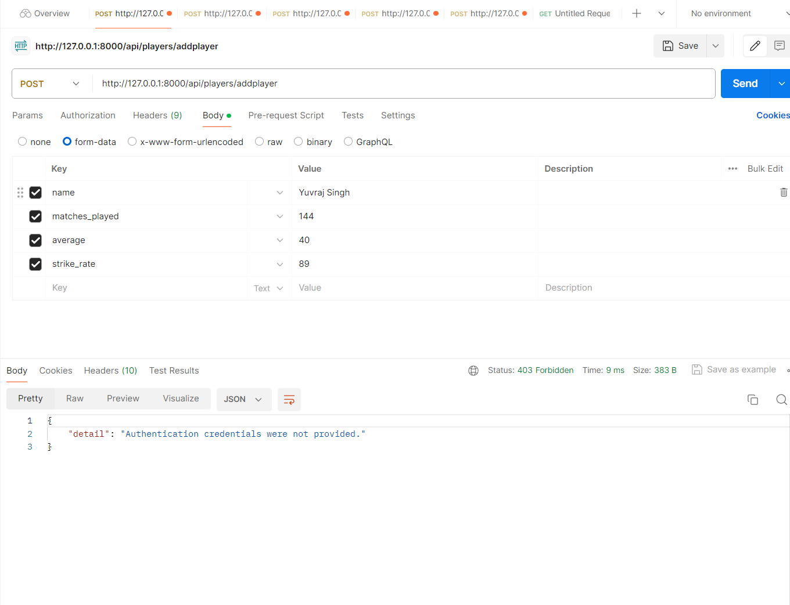
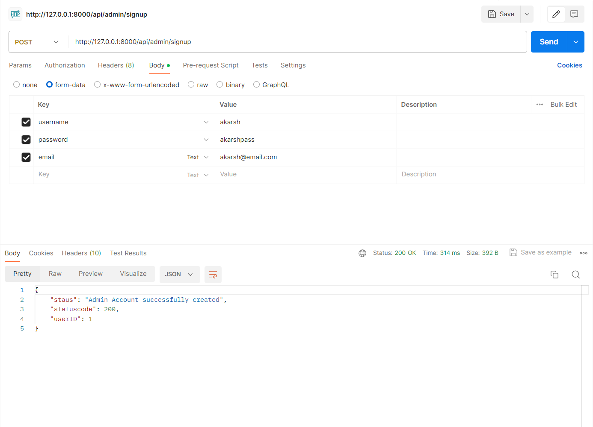
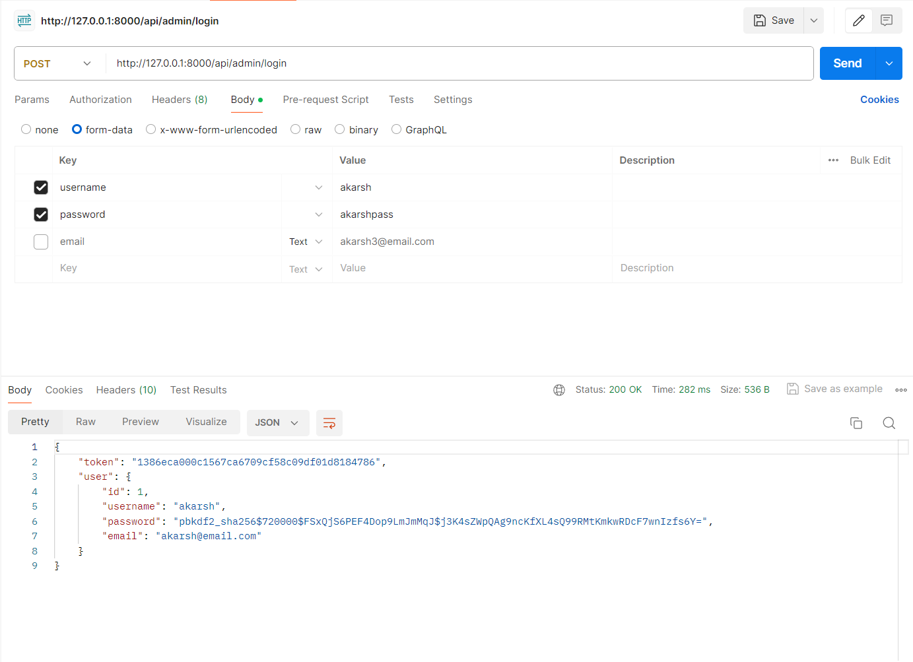
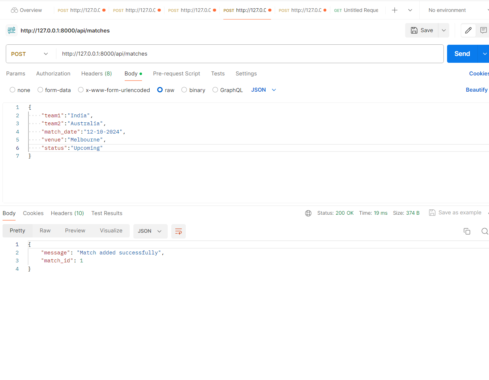
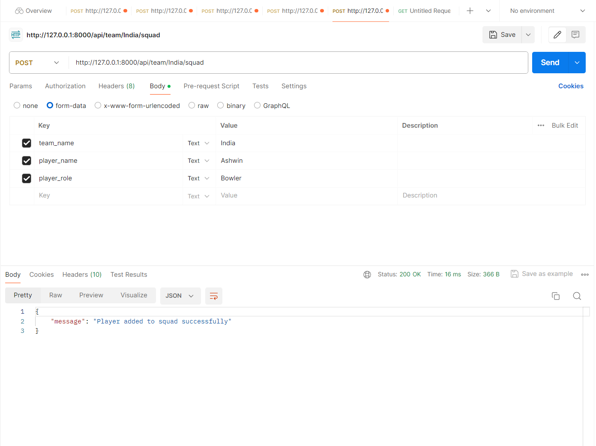
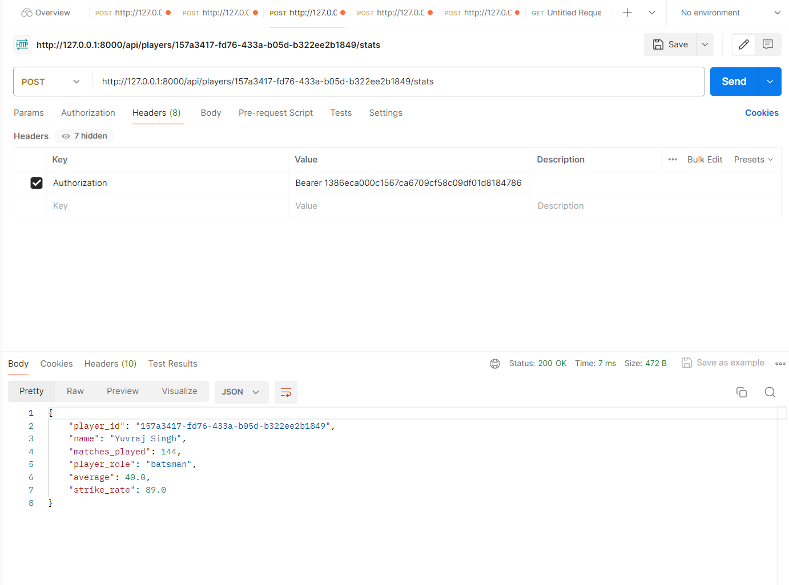
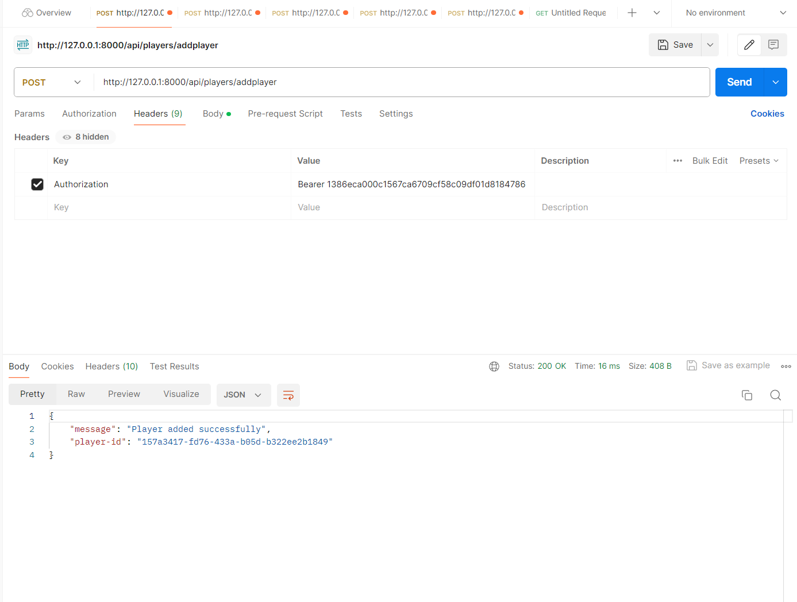

# Cricbuzz

A Role Based Access control, Specifically designed for two Roles - Admin, User.
The User is able to view matches & their details.
The Admin is able to view, manage & change details of the matches and the players 

## Table of Contents

- [Installation](#installation)
- [Usage](#usage)
- [API Endpoints](#api-endpoints)


## Installation

The Framework it has been based on is Django & Database used is Postgres

To run the code, Kindly install the following packages- 

```bash
pip install Django  DjangoRestFramework Psycopg2
```


## Usage

To Run the command 

```bash
python manage.py migrate
python manage.py runserver
```

## API Endpoints

List and details of API endpoints are here.

Guest Accessible EndPoints 
- `GET /api/matches`: Provides a list of all the matches that going to be played.


- `GET /api/matches/{match_id}`: Provide details of specific match by ID and shows the players that are in the squad of the team



#Admin Accessible Endpoints 

Note - The Admin API Endpoints are protected by Token Authenication, The methods will only work if we pass Authorization in Header : "Bearer {Token Value}"


Admin Authentication
- `POST /api/admin/signup`: Provides Signup functionality of Admin


- `POST /api/admin/login`: Provides Login Functionality of Admin, if credentials are passes correctly it return Token Value that can be used.



Matches
- `POST /api/matches`: Helps to create Match by taking input parameters of required feild.

- `POST /api/teams/{team_id}/squad`: Helps us to add players to the team squad

- `POST /api/players/{player_id}/stats`: Helps us to fetch the statistics of the players by Players ID

- `POST /api/players/addplayer`: Helps us to add players to our database



